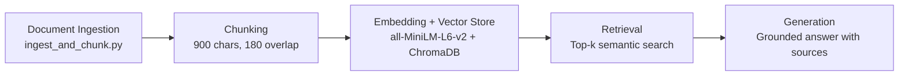

You are helping implement Milestone 4 (Embedding + Retrieval) for a RAG system.

Use this full architecture as context:

Project retrieval approach constraints:
- Embedding model: all-MiniLM-L6-v2
- Retrieve top-k chunks (5 to 10)

Existing ingestion output to use:
- Input chunks file: artifacts/chunks.jsonl
- Each line is JSON with fields including:
  - chunk_id
  - doc_id
  - chunk_index
  - text
  - char_count
  - metadata (source metadata like url/domain)

Please implement Python code that does the following:
1. Loads chunks from artifacts/chunks.jsonl.
2. Embeds chunk text using sentence-transformers model all-MiniLM-L6-v2.
3. Stores vectors in a persistent ChromaDB collection.
4. Preserves source metadata so retrieval can cite sources later.
5. Provides a retrieval function that:
   - takes a query string and top_k
   - embeds the query with the same model
   - returns top-k matching chunks with text, metadata, and similarity/distance scores.
6. Include a CLI with an "embed" command and a "query" command.

Keep code readable and robust for JSONL parsing and missing fields.
