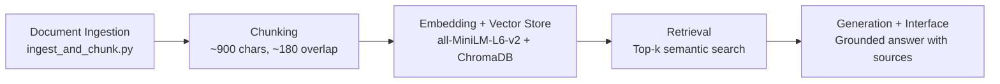

You are helping implement Milestone 5 (Grounded Generation + Interface) for a RAG system.

Use this architecture as strict context:



Project requirements from planning.md:
- Domain: unofficial advice on getting CS internships in the US.
- Embedding model is already fixed: all-MiniLM-L6-v2.
- Retrieval already returns top-k chunks with metadata + distances.
- Generation must be grounded: answer ONLY from retrieved chunks.

Implement code in Python by extending existing retrieval pipeline with:

1) Grounded generation function
- Input: user query string, top_k, distance threshold.
- Retrieve chunks first from Chroma.
- Build context block from retrieved chunks with labels like [S1], [S2], including source name and distance.
- Call LLM (Groq client) to generate answer.

2) Strict grounding prompt (must enforce, not suggest)
- System prompt must include all of these constraints:
  - "Answer only from provided retrieved context."
  - "If context is insufficient, explicitly say you do not have enough evidence."
  - "Do not use outside knowledge."
  - "Cite source labels [S1], [S2] in claims."

3) Output format (programmatically guaranteed)
- Return structured output object:
  - answer: string
  - sources: list of objects derived from retrieval metadata (NOT parsed from LLM text)
    - each source item should include source id label, source name/url/path, rank, distance, chunk_id
- Important: source list must be built from retrieval rows in code, regardless of whether LLM cites correctly.

4) Interface
- Add terminal interface command (`chat`) for interactive Q&A.
- If using Gradio, use this skeleton:

```python
import gradio as gr

def answer_fn(question: str):
    # retrieval -> grounded generation
    return answer_text, sources_text

ui = gr.Interface(
    fn=answer_fn,
    inputs=gr.Textbox(lines=2, label="Question"),
    outputs=[
        gr.Textbox(lines=10, label="Grounded answer"),
        gr.Textbox(lines=8, label="Sources used"),
    ],
    title="Unofficial Guide RAG",
    description="Answers must be grounded in retrieved context.",
)
ui.launch()
```

5) CLI wiring
- Keep existing commands for embed/query/eval.
- Add:
  - ask: one-shot grounded answer for --q
  - chat: terminal loop
  - serve: Gradio web app (optional but preferred)

6) Safety checks
- If API key missing, raise clear runtime error.
- If no retrieval context passes threshold, either:
  - fall back to top few chunks with a low-confidence warning, or
  - return insufficient-evidence response.

7) Deliverables
- Updated Python script with generation + interfaces wired.
- A short README section with run commands.

Code quality constraints:
- Keep code readable and modular.
- Preserve existing metadata and retrieval behavior.
- Avoid breaking current Milestone 4 commands.
